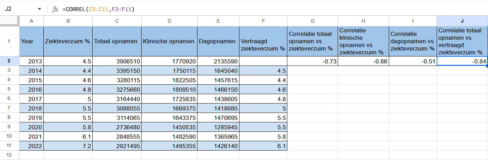
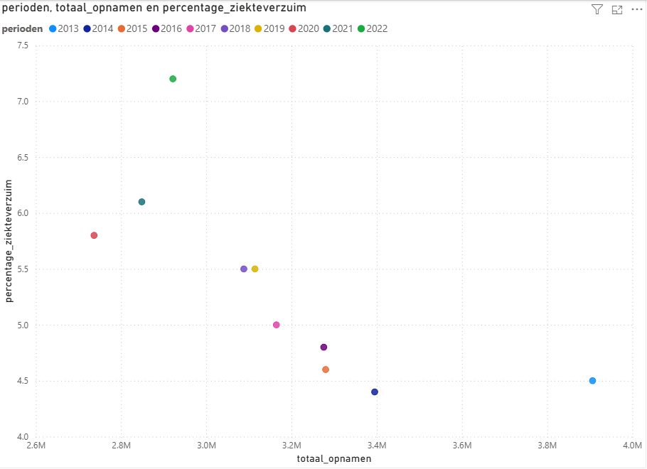

# Sick-Leave-vs.-Hospital-Admissions-A-SQL-Power-BI-Analysis-of-Dutch-Healthcare-Data-2013-2022-.

**Author:** Lucrezia Biancamaria Scarfo

---

## Objective

This project investigates the relationship between the percentage of sick leave among hospital employees and hospital workload in the Netherlands between 2013 and 2022. The goal is to identify potential trends or correlations between employee absenteeism and the pressure on the healthcare system, using hospital admissions as a proxy for workload.

---

## Datasets Used

### Ziekteverzuim (Sick Leave Percentage)
- **Description:** Contains annual sick leave percentages per sector, including the healthcare sector and specifically hospital workers.  
- **Source:**  
  https://opendata.cbs.nl/statline/#/CBS/nl/dataset/80072ned/table?ts=1752410304644

### Ziekenhuisopnamen (Hospital Admissions)
- **Description:** Provides detailed records of hospital admissions, including clinical and day admissions, broken down by year.  
- **Source:**  
  https://opendata.cbs.nl/statline/#/CBS/nl/dataset/84523NED/table?ts=1752416814666

---

## Limitation

The analysis uses data filtered on SBI-code 861 ("Ziekenhuizen") from CBS, which includes general hospitals, academic medical centers, and categorical hospitals. However, it also encompasses mental health and addiction care facilities with overnight stays. As a result, the sick leave percentage used may reflect a broader group of healthcare workers than just hospital staff, which could influence the correlation results. A more granular dataset distinguishing between subcategories within SBI 861 would allow for a more precise analysis.

---

## Data Preparation and Cleaning

### Filtering and Download
- The datasets were filtered directly on the CBS StatLine platform and downloaded as CSV files.

### Handling Multilevel Headers
- The hospital admissions dataset included complex, nested headers.  
- The raw unedited data and accompanying metadata were downloaded.  
- The data was imported into Google Sheets for cleaning.

### Cleaning Steps in Google Sheets
- Used formulas like `LEFT` and `LEN` to extract relevant information and standardize formats.  
- Used Find and Replace to decode categorical tags (e.g., replacing period codes like `2013JJ00` with `2013`).  
- Ensured column alignment and header consistency to enable later import into MySQL Workbench.

---

## Database Setup

- Created a MySQL database named `hospital_data` using MySQL Workbench.  
- Defined and populated the following tables:  
  - `ziekenhuis_opnamen`: contains hospital admission counts by year.  
  - `ziekteverzuim_percentage`: contains annual sick leave percentages by sector.  
- Data was inserted manually.

---

## Analysis on MySQL Workbench

### Data Preparation

- Created a new table `correlatie` by joining the two datasets:  
  - `ziekteverzuim_percentage` (sick leave percentages per year and sector)  
  - `ziekenhuis_opnamen` (hospital admission data including total, clinical, and day admissions)  
- The join was performed on the `perioden` (year) column, filtered to include only the sector `'861 Ziekenhuizen'` to focus on hospitals.  
- This combined table simplifies correlation analysis by bringing together all relevant data points in one place.

### Step-by-Step Correlation Checks

#### Sick Leave % vs. Total Hospital Admissions
- Manually calculated Pearson correlation coefficient: **-0.73**  
- Interpretation: A strong negative relationship was observed.

#### Sick Leave % vs. Clinical Admissions (`klinische_opnamen`)
- Correlation coefficient: **-0.85**  
- Interpretation: Even stronger negative relationship.

#### Sick Leave % vs. Day Admissions (`dagopnamen`)
- Correlation coefficient: **-0.51**  
- Interpretation: Moderate negative relationship.

## SQL Queries

All SQL queries used to create tables and calculate correlations are saved in the file [`queries.sql`](queries.sql).  
Feel free to review or run these queries to reproduce the analysis in MySQL Workbench.

---
## Lagged Analysis (Performed in Google Sheets)

To explore whether hospital admissions in one year might influence sick leave rates in the following year, I conducted a lagged correlation analysis in **Google Sheets**.

- Created a new column titled `Vertraagd ziekteverzuim %` (Lagged Sick Leave %)  
- Shifted sick leave percentages forward by one year  
- Calculated Pearson correlation between:  
  - Year *t* hospital admissions  
  - Year *t+1* sick leave %

**Result:**  
📉 **Pearson correlation coefficient**: `-0.84`  
💡 **Interpretation**: A strong negative correlation — higher admissions are followed by lower sick leave the next year.

  

---

## Data Visualization in Power BI

- Imported the MySQL database created in MySQL Workbench directly into Power BI.  
- Updated the column name from `total_opnamen` to `totaal_opnamen` to keep the dashboard fully in Dutch.  
- Used scatter plots to visualize correlations over the years, effectively showing the relationship between sick leave percentages and hospital admissions.

  

---

## Further Analysis in Google Sheets

- To ensure accuracy of the Pearson correlations calculated in MySQL, I re-calculated them in Google Sheets, confirming the results.  
- The lagged analysis described above was also performed in Google Sheets for exploratory purposes.

---

## Correlation Method Used

Pearson correlation coefficient was used to measure the strength and direction of relationships between sick leave percentage and hospital admissions. It ranges between -1 and +1:

- Close to +1: strong positive correlation (both increase together)  
- Close to -1: strong negative correlation (one increases while the other decreases)  
- Close to 0: no clear relationship

---

## Conclusion

This analysis found a strong negative correlation between sick leave percentage and total hospital admissions (-0.73), even stronger for clinical admissions (-0.85), and a moderate negative correlation for day admissions (-0.51). The lagged analysis (done in Google Sheets) suggested that higher hospital admissions may be followed by lower sick leave the next year (-0.84 correlation).

Given the limitation that sick leave data includes both hospital and mental healthcare employees, future analysis should seek more specific data on:

- Sick leave percentages for hospital staff exclusively  
- Number of hospital employees per year

---

## Project Context & Goal

This project was conducted independently as part of my transition into data analytics. It uses publicly available datasets to explore a real-world question using SQL and spreadsheets.

Although the dataset could have been analyzed entirely in spreadsheets, I chose SQL to demonstrate structuring, joining, and analyzing data in a relational database.

The main goal was to showcase practical data skills, critical thinking about data limitations, and the ability to draw meaningful conclusions with available resources.

---

**Thank you for reviewing this project!**
